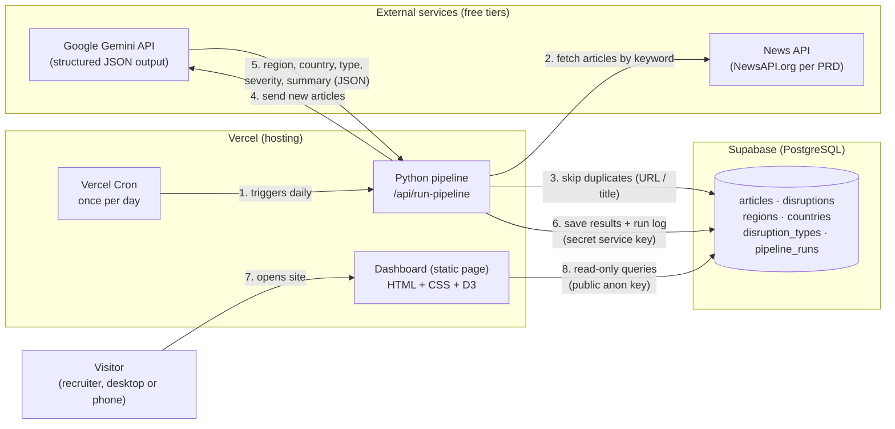

# Architecture — Supply Chain Disruption Monitor

## Diagram



Plain-text version (for terminals and slides):

```
                 ┌──────────────────────── VERCEL ────────────────────────┐
                 │                                                        │
                 │  ┌─────────────┐  1. daily   ┌──────────────────────┐  │
                 │  │ Vercel Cron │────────────►│   Python pipeline    │  │
                 │  └─────────────┘             │  /api/run-pipeline   │  │
                 │                              └──┬───────┬───────┬───┘  │
                 │                                 │       │       │      │
                 │  ┌──────────────────────┐       │       │       │      │
  Visitor ──7──► │  │  Dashboard (static)  │       │       │       │      │
 (recruiter)     │  │   HTML + CSS + D3    │       │       │       │      │
                 │  └──────────┬───────────┘       │       │       │      │
                 └─────────────┼───────────────────┼───────┼───────┼──────┘
                               │ 8. read-only      │       │       │
                               │  (anon key)       │ 2.    │ 4./5. │ 3./6. write
                               ▼                   ▼       ▼       ▼ (service key)
                 ┌──────────────────────┐  ┌──────────┐ ┌────────┐ │
                 │  SUPABASE (Postgres) │  │ News API │ │ Gemini │ │
                 │  articles            │◄─┼──────────┼─┼────────┼─┘
                 │  disruptions         │  └──────────┘ └────────┘
                 │  regions / countries │
                 │  disruption_types    │
                 │  pipeline_runs       │
                 └──────────────────────┘
```

## How data flows (one daily run)

1. **Vercel Cron** calls the pipeline endpoint once a day (Hobby plan allows one daily run, timing ±59 min).
2. The **Python pipeline** asks the news API for articles matching the keyword list ("port strike", "tariff", …).
3. It cleans each URL and title and **checks Supabase for duplicates** — duplicates are dropped *before* calling Gemini, so no free-tier quota is wasted. New articles are saved with status `pending`.
4. Each new article's title + snippet is **sent to Gemini** with a structured prompt.
5. Gemini returns **JSON**: is it a real disruption? If yes → region, country, disruption type, severity (low/medium/high), one-sentence summary.
6. The pipeline **saves** the verdict on the article, adds a row to `disruptions` for real ones, and writes a `pipeline_runs` log row (counts, success/failure).
7. A **visitor** opens the website.
8. The **page reads** Supabase directly (public read-only key + Row Level Security) and calculates KPIs, map colors, trend chart and feed in the browser.

## Components

| Component | Job | Why this choice |
|---|---|---|
| News API | Source of raw articles | Named in the PRD; isolated in one pipeline step so it can be swapped for another source without touching the rest |
| Gemini API | Turns unstructured text into structured risk data | PRD choice; supports JSON output mode, free tier |
| Python pipeline | Fetch → dedupe → extract → save | PRD: Python for the data pipeline; runs as a Vercel Python function (5-minute limit on Hobby, enough for a daily batch) |
| Vercel Cron | Runs the pipeline daily so data accumulates | PRD choice; no separate server to manage |
| Supabase | Stores everything | Hosted Postgres the live site can read directly — local SQLite can't be reached from a deployed website |
| Dashboard (static page) | The approved v2 design: banner, map, trend chart, feed, region + type filters | Keeps the approved prototype exactly; reads Supabase directly with the public read-only key; deploys on Vercel as static files |

## Security

- **Keys never in code.** Locally in `.env` (listed in `.gitignore`); in production in Vercel environment variables.
- **Two Supabase keys:**
  - *Service key* (secret) — only the pipeline has it; it can write.
  - *Publishable key* (public) — used by `web/config.js`; Row Level Security allows **read only** (tested: writes are refused with HTTP 401).
- The pipeline endpoint checks Vercel's `CRON_SECRET` header, so a random visitor can't trigger runs and burn API quota.
- The website's Refresh button only re-reads the database; it never triggers the pipeline.

## Out of scope (per PRD)

Real-time streaming, forecasting, paid tiers, mobile app.
