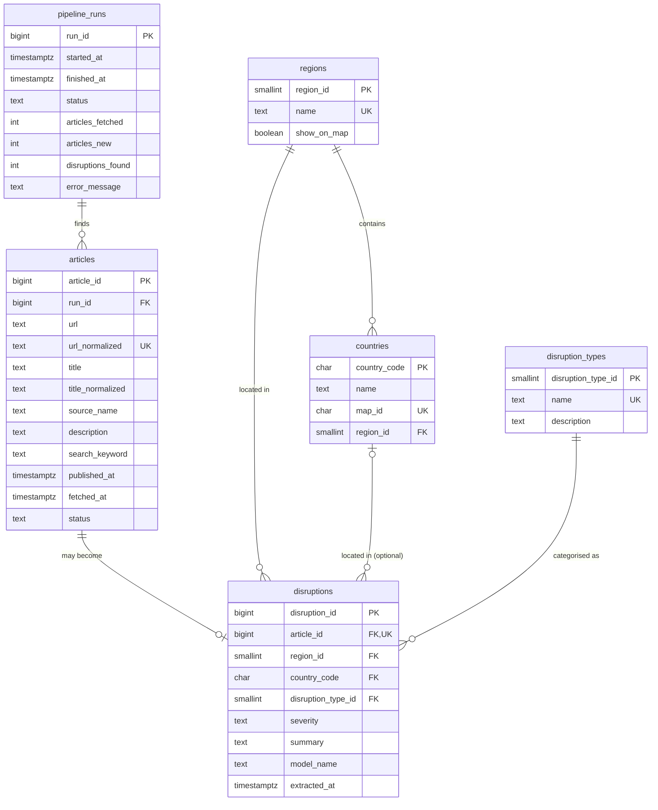

# Data Model — Supply Chain Disruption Monitor

Status: **approved design** (decisions D1–D14 resolved with the recommended options).
Nothing has been created in Supabase yet — this is the blueprint for the next step.

Related: [ARCHITECTURE.md](ARCHITECTURE.md) · [architecture.png](architecture.png) · [PROJECT_REQUIREMENTS.md](PROJECT_REQUIREMENTS.md)

**Two terms used everywhere:**
- **Primary key (PK)** — a column that uniquely identifies each row (like a student ID).
- **Foreign key (FK)** — a column that points to another table's PK (like a class roster listing student IDs).

---

## 1. Approved decisions

| # | Decision | Final answer |
|---|---|---|
| D1 | Architecture | As in `ARCHITECTURE.md` / `architecture.png`: Vercel Cron → Python pipeline → News API + Gemini → Supabase → Next.js site |
| D2 | Approved UI | Prototype **v2** (`Disruption Monitor v2 -blue-.html`) |
| D3 | Country | Gemini extracts **one primary country** per article (ISO code). Optional — blank when no single country applies (e.g. "Red Sea") |
| D4 | Regions | 8 regions: East Asia, South Asia, Middle East, Europe, North America, Latin America, Africa & Oceania, **Global**. Country→region follows v2 (e.g. Egypt & Turkey → Middle East, Mexico → North America, Panama → Latin America, Vietnam & Thailand → East Asia). "Global" is for worldwide events and is not drawn on the map |
| D5 | Disruption types | Labour action · Weather event · Tariff / policy · Geopolitical · Supplier shortage · Port / shipping delay · Other ¹ |
| D6 | Severity Index | **Replaced** by the PRD's wording: the chart shows **weekly counts of disruption signals**, with a toggle to group lines **by region** or **by severity** (the latter is the PRD's "severity trend") |
| D7 | Confidence score | **Removed** from UI and schema |
| D8 | Date used for charts and cards | `published_at` (when the publisher released the article) |
| D9 | Time windows | KPIs, map and region list: **last 30 days**. Trend chart: **last 8 weeks** |
| D10 | Counting unit | One flagged article = one **disruption signal**. Headline reads e.g. *"14 disruption signals across 6 regions, from 312 articles screened"* |
| D11 | Duplicate rule | Same cleaned URL (enforced by the database) **or** same cleaned headline seen in the last 7 days (checked by the pipeline) |
| D12 | Refresh button / Next steps panel | Refresh only **re-reads the database** (never runs the pipeline). "Next steps" panel **removed** (not in PRD) |
| D13 | Map tooltip label | Disruption type of the country's **most severe** signal (tie → most recent), plus signal count, e.g. *"Labour action · 4 signals"* |
| D14 | Store rejected articles? | **Yes** — needed for "articles screened" KPI and so they're never re-sent to Gemini |

¹ Renamed v2's "Weather / drought" to **"Weather event"** so typhoons, floods and monsoons fit too.

---

## 2. Why this structure (6 tables)

```
articles          ← what the news said        (pipeline stage 1: fetch)
disruptions       ← what the AI concluded     (pipeline stage 2: extract)
regions           ┐
countries         ├ fixed lists that keep categories consistent
disruption_types  ┘
pipeline_runs     ← one row per daily run (powers "LAST RUN")
```

- **Not one flat table:** it couldn't count rejected articles, typos from the AI ("E. Asia") would silently break filters, and rejected articles would be re-sent to Gemini every day.
- **Not more tables:** grouping articles into "events" or storing many countries per article adds complexity the PRD doesn't need.
- **Metrics are never stored.** KPIs, map colors and chart values are calculated from the raw rows when the page loads — change a formula later and no data needs rewriting.

**Interview line:** *"Articles store what the news said, disruptions store what the AI concluded, and lookup tables keep the categories consistent."*

---

## 3. Entity relationship diagram



Plain-text version:

```
pipeline_runs 1 ──── many articles 1 ──── 0..1 disruptions
                                                │  │  │
regions 1 ──── many countries 1 ──── many ──────┘  │  │   (country optional)
regions 1 ──────────────────────────── many ───────┘  │
disruption_types 1 ─────────────────── many ──────────┘
```

**Reading the relationships:**
- A **run** finds many **articles**; each article remembers the run that first found it.
- An **article** becomes **zero or one disruption** — rejected articles have none.
- A **region** contains many **countries**; each country belongs to exactly one region.
- Each **disruption** has one region, one type, and optionally one country.

Why store `region_id` on a disruption when the country implies it? Because some disruptions have a region but no country (Red Sea → Middle East; worldwide → Global). When a country *is* present, the pipeline copies its region from `countries`, so the two can never disagree.

---

## 4. Data dictionary

`timestamptz` = date + time stored in UTC. "Auto-number" = the database assigns 1, 2, 3… automatically.

### `regions` — lookup, 8 rows
| Column | Type | Key | Purpose |
|---|---|---|---|
| region_id | smallint, auto-number | PK | Unique ID |
| name | text, unique, not null | | "East Asia" … "Global" — shown in chart, filters, feed |
| show_on_map | boolean, not null | | `false` only for Global (no map shape) |

### `countries` — lookup, one row per country on the world map
| Column | Type | Key | Purpose |
|---|---|---|---|
| country_code | char(2) | PK | ISO code ("US", "CN"). Gemini must return one of these, never free text |
| name | text, not null | | Display name |
| map_id | char(3), unique | | ISO numeric code ("840") matching the world-map file, so the right shape is coloured. Safer than matching names ("United States of America" vs "USA") |
| region_id | smallint, not null | FK → regions | Region this country belongs to — lets a map click filter by region |

### `disruption_types` — lookup, 7 rows
| Column | Type | Key | Purpose |
|---|---|---|---|
| disruption_type_id | smallint, auto-number | PK | Unique ID |
| name | text, unique, not null | | "Labour action", etc. — feed label, type filter dropdown |
| description | text | | One-line definition, also placed in the Gemini prompt so classification is consistent |

### `pipeline_runs` — one row per scheduled run
| Column | Type | Key | Purpose |
|---|---|---|---|
| run_id | bigint, auto-number | PK | Unique ID |
| started_at | timestamptz, not null | | When the run began |
| finished_at | timestamptz | | When it ended — powers "LAST RUN" |
| status | text: `running` / `success` / `failed` | | Outcome |
| articles_fetched | integer | | Articles the news API returned |
| articles_new | integer | | Left after duplicates removed |
| disruptions_found | integer | | Flagged by Gemini as real |
| error_message | text | | What went wrong, if anything |

### `articles` — every unique article fetched (disruption or not)
| Column | Type | Key | Purpose |
|---|---|---|---|
| article_id | bigint, auto-number | PK | Unique ID |
| run_id | bigint, not null | FK → pipeline_runs | Run that first found it |
| url | text, not null | | Original link — "Open source article →" |
| url_normalized | text, **unique**, not null | | Cleaned URL for duplicate detection (§5) |
| title | text, not null | | Headline on the feed card |
| title_normalized | text, not null | | Cleaned headline for duplicate detection (§5) |
| source_name | text | | "Reuters", "Bloomberg" |
| description | text | | News API snippet — title + snippet is what Gemini reads. Full article text is not stored |
| search_keyword | text | | Keyword that found it (useful for README "My Process") |
| published_at | timestamptz, not null | | Publisher's date — used for charts and card dates (D8) |
| fetched_at | timestamptz, not null | | When the pipeline pulled it |
| status | text: `pending` / `disruption` / `not_disruption` / `failed` | | Gemini's verdict. `failed` = API error → retried next run |

### `disruptions` — only articles Gemini flagged as real
| Column | Type | Key | Purpose |
|---|---|---|---|
| disruption_id | bigint, auto-number | PK | Unique ID |
| article_id | bigint, **unique**, not null | FK → articles | Source article; unique = one extraction per article |
| region_id | smallint, not null | FK → regions | Affected region |
| country_code | char(2), nullable | FK → countries | Primary affected country, blank if none |
| disruption_type_id | smallint, not null | FK → disruption_types | Category |
| severity | text: `low` / `medium` / `high` only | | Drives the one colour scheme used everywhere |
| summary | text, not null | | Gemini's one-sentence summary |
| model_name | text, not null | | Gemini model that produced the row (shown in the feed header) |
| extracted_at | timestamptz, not null | | When Gemini processed it |

At a few thousand rows, no indexes beyond the unique ones are needed.

---

## 5. Duplicate prevention

Checks run **before** calling Gemini, so duplicates never cost API quota.

| Layer | Catches | How |
|---|---|---|
| 1. Same URL | Same article from two keyword searches or two different days | Pipeline cleans the URL (lowercase, remove `utm_` tracking tags, `#anchors`, trailing `/`). Database **rejects** a repeated `url_normalized` (unique rule); the insert is "add if new, otherwise skip" |
| 2. Same headline | Same wire story republished at a different URL | Pipeline cleans the title (lowercase, strip punctuation/extra spaces) and skips it if that exact title was stored in the **last 7 days**. The 7-day window lets recurring generic titles ("Weekly freight update") through later |
| 3. Junk | `[Removed]` placeholders, missing title or URL | Skipped before insert |

**Not duplicates (by design):** different outlets writing their own stories about the same event. Each is a separate *signal* — that's what "4 signals" in the map tooltip means.

---

## 6. How each dashboard component gets its data

All windows use `published_at`: **30 days** for KPIs/map/region list, **8 weeks** for the chart. "Signals" = rows in `disruptions`.

| Component | Calculation |
|---|---|
| **LAST RUN** | `finished_at` of the latest `pipeline_runs` row with status `success`. "NEXT IN" is calculated from the cron schedule |
| **Headline** | *"{signals} disruption signals across {regions} regions, from {screened} articles screened"* — regions counts distinct regions with ≥ 1 signal, excluding Global |
| **KPI: Articles screened** | Articles with status `disruption` or `not_disruption` in 30 days |
| **KPI: Disruption signals** | Signals in 30 days |
| **KPI: High severity** | Signals in 30 days with severity `high` |
| **World map colour** | Per country: highest severity among its signals in 30 days (high > medium > low). No signals → grey. Joined to map shapes via `countries.map_id` |
| **Map tooltip** | Country name · highest severity · type of the most severe signal (tie → most recent) · signal count |
| **Trend chart** | Signals per week (Monday-start, UTC) over 8 weeks. Toggle: one line per **region** or per **severity**. Weeks with no signals show 0; the current week is marked "in progress" |
| **Region list** (beside chart) | Signal count per region, last 30 days |
| **Feed** | Signals joined to their article, region, type and country, newest `published_at` first. Shows severity tag, headline, summary, region, type, source, date, link. A saved database **view** (`disruption_feed`) will flatten these joins so the site makes one simple request |
| **Region filter** | Keep only signals with the chosen `region_id`. Clicking a country looks up `countries.region_id` → filters to that region |
| **Type filter** | Keep only signals with the chosen `disruption_type_id`; dropdown filled from `disruption_types`. *(New UI control — v2 doesn't have one yet; PRD requires it)* |
| **Refresh button** | Re-runs the reads above; never triggers the pipeline |

**Access rules:** the website uses Supabase's public *anon* key with Row Level Security set to **read-only**. Only the pipeline, holding the secret *service* key (stored in Vercel), can write.

---

## 7. UI changes this model requires (vs. prototype v2)

1. Trend chart: "Severity index 0–100" → **weekly signal counts**, with a Region / Severity toggle.
2. Region list: index value → **30-day signal count**.
3. Feed cards: **remove the confidence row**.
4. Headline wording: "active disruptions" → **"disruption signals"**; KPI labels to match.
5. **Add a disruption-type filter.**
6. Remove the **"Next steps"** panel; Refresh re-reads data only.
7. Add **Africa & Oceania** to the region list (fixes v2's dead map clicks there).
8. Feed header model label comes from the latest `model_name` instead of hardcoded text.

---

## 8. SQL files

- [`supabase/schema.sql`](supabase/schema.sql) — creates the 6 tables, fills in regions and disruption types, creates the `disruption_feed` view, and sets read-only access for the public website. **Written, not yet run.**
- [`supabase/seed_countries.sql`](supabase/seed_countries.sql) — 173 countries, **generated** (not hand-typed) by [`supabase/generate_seed_countries.py`](supabase/generate_seed_countries.py) from the dashboard's world-map file (world-atlas 2.0.2) and the ISO 3166 code list (lukes v10.0). Run after `schema.sql`. **Written, not yet run.**
  - Region rule: UN sub-region → our 8 regions, with overrides Egypt → Middle East, Mexico → North America (both per v2), Iran → Middle East, Taiwan → East Asia (no UN region in source). Central Asia → South Asia.
  - Not included: Kosovo, N. Cyprus, Somaliland (the map file gives them no ISO code, so they stay grey) and Antarctica.
