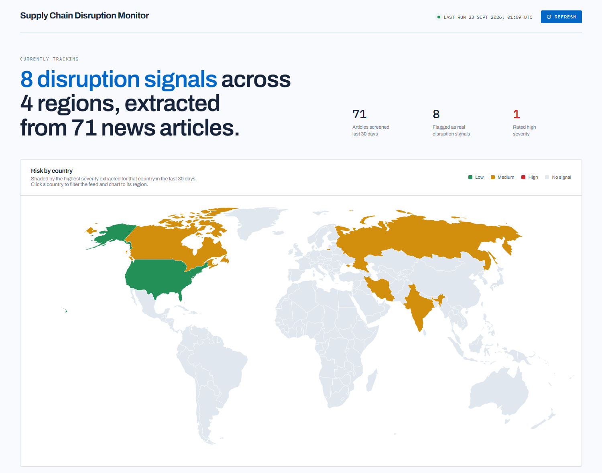
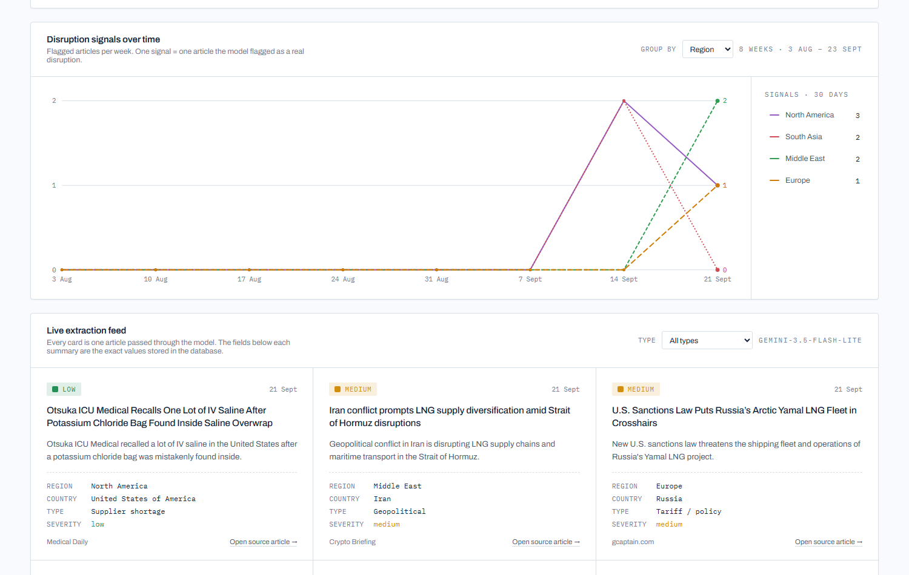
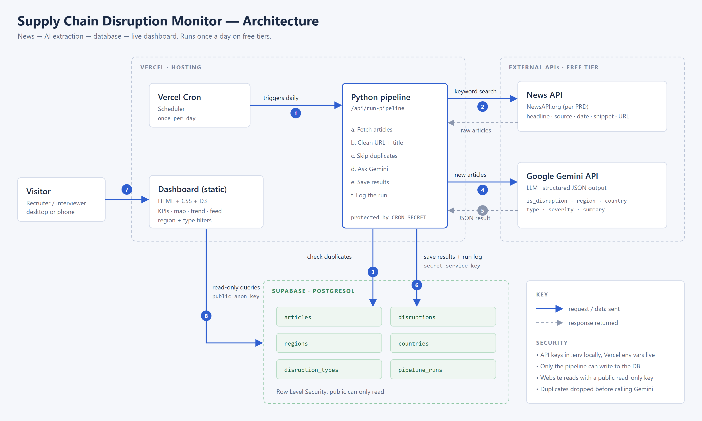

# Supply Chain Disruption Monitor

**An AI pipeline that reads the news every day, decides which stories are real supply chain disruptions, and maps them by region, country and severity.**

🔗 **Live dashboard: [supply-chain-disruption-monitor.vercel.app](https://supply-chain-disruption-monitor.vercel.app)**



Built by **Abishek Kolanjiappan** as a portfolio project for supply chain analyst roles.
It runs entirely on free tiers and updates itself every day without anyone touching it.

---

## Overview

Supply chain risk lives in unstructured text — a strike announcement, a canal restriction, a
new export rule. This project turns that text into data you can count.

Every day, a pipeline:

1. **Searches the news** for supply-chain keywords (NewsAPI)
2. **Removes duplicates** before anything costly happens — same URL, or the same headline within 7 days
3. **Asks Google Gemini**, in batches, one question per article: *is this a real disruption?* If yes, it returns the region, country, disruption type, severity and a one-sentence summary as structured JSON
4. **Stores** the result in PostgreSQL (Supabase), keeping the rejected articles too, so the screening rate is measurable
5. **Shows** it on a live dashboard: risk by country, signals per week, and a feed proving each number came from a real article

The dashboard reads the database directly with a read-only key. Only the pipeline can write.



---

## How it works



| Layer | Choice | Why |
|---|---|---|
| Ingestion | Python + NewsAPI | Simple, and isolated in one module so the news source can be swapped |
| Extraction | Gemini 3.5 Flash-Lite, JSON schema output | Free tier; the schema restricts answers to values the database accepts |
| Storage | Supabase (PostgreSQL) | A hosted database the live site can read directly |
| Dashboard | HTML + CSS + D3 on Vercel | The approved design, no build step, deploys on every push |
| Scheduling | GitHub Actions, daily 06:17 UTC | No 5-minute function limit, clear logs, e-mail on failure |

**Detail:** [ARCHITECTURE.md](ARCHITECTURE.md) · [DATA_MODEL.md](DATA_MODEL.md) · [SCHEDULING.md](SCHEDULING.md) · [SQL_Learning_Guide.pdf](SQL_Learning_Guide.pdf)

### The database in one glance

```
articles      what the news said        ─┐
disruptions   what the AI concluded     ─┘ one-to-one, only for real disruptions
regions · countries · disruption_types    fixed lists, so categories stay consistent
pipeline_runs one row per daily run       counts, status, errors
```

The database enforces its own rules: a unique constraint blocks duplicate articles, check
constraints allow only valid severities and statuses, and foreign keys prevent rows pointing
at regions or countries that don't exist. Row Level Security gives the public site read-only
access — verified by a script that logs in as the public role and confirms writes are refused.

---

## My process

**I designed the data model before writing any code.** The UI prototype implied fields the
brief never defined — a "severity index 0–100" with no formula, and a "confidence score" the
model would invent about itself. Rather than guess, I listed them as decisions, replaced the
index with what the brief actually asked for (weekly counts of flagged articles), and dropped
the confidence score. Fourteen such decisions are recorded in [DATA_MODEL.md](DATA_MODEL.md).

**I generated the country list instead of typing it.** The map colours countries by matching
an ISO number, so the list was generated from the same map file the dashboard draws, joined to
the official ISO 3166 codes ([`generate_seed_countries.py`](supabase/generate_seed_countries.py)).
173 countries, no typos, reproducible.

**Then the free tiers pushed back, and the design had to adapt:**

| Problem hit | Fix |
|---|---|
| Gemini's free quota stopped a run after 20 requests | Batch 10 articles per request — the same work now costs 2 requests instead of 22 |
| A batch that fails shouldn't lose 10 articles | Answers are matched back by `article_id`, and each article is validated and saved separately. One bad answer fails one article |
| Searching only headlines returned **zero** results for combined queries | Measured it, then searched the full text and let the model filter instead |
| The pipeline got `permission denied` writing to the database | Newer Supabase projects don't grant table access automatically. Added a targeted grant for the pipeline's role only, keeping the website read-only |
| The Refresh button looked broken | It was working — it just never said so. It now reports "UP TO DATE · CHECKED hh:mm" |

**Everything is tested without spending quota.** 40 offline tests cover URL and headline
normalisation, duplicate detection, batch matching, rate-limit retries, and partial failures,
with NewsAPI and Gemini replaced by fakes. The database has its own verification script with
17 checks.

---

## Key findings

*From 74 articles screened and 8 disruption signals, 19–22 September 2026. Early data — the
pipeline has been collecting for days, not weeks, so these are directional.*

**1. The search vocabulary matters more than the model.**

| Keyword | Articles found | Real disruptions | Hit rate |
|---|---|---|---|
| shipping delay | 1 | 1 | 100% |
| supplier shortage | 5 | 1 | 20% |
| geopolitical incident | 36 | 5 | 14% |
| tariff | 25 | 1 | 4% |
| weather event | 7 | 0 | 0% |
| **port strike** | **0** | **0** | — |

"Port strike" — the most obvious supply chain keyword there is — returned **nothing at all**,
including over a separate 7-day test. Meanwhile "tariff" returned 25 articles, of which 24 were
market commentary. Broad terms buy volume, not signal. Testing showed specific industry phrases
("blank sailings", "force majeure", "pipeline shutdown") find genuine events that the current
keywords miss entirely.

**2. Most of the AI's value is in saying no.** 66 of 74 articles were rejected — an 11%
signal rate. The model correctly discarded stock commentary, REIT investment tips, a nasal
spray advert and an AI policy debate, while catching a US tariff hitting Canadian dairy
exporters and a shutdown of Saudi Arabia's East-West pipeline. For a monitoring tool, the
filtering *is* the product; without it a human would read 9 irrelevant articles for every
useful one.

**3. Free news sources skew the picture.** The most frequent source in the database is
*Crypto Briefing* (12 articles). None of the trade press where port and shipping news actually
lives — Lloyd's List, the Journal of Commerce — is available on the free tier. Every one of the
8 confirmed disruptions came from general news outlets. **Any conclusion from this data is a
statement about what free general news reports, not about global supply chains.** That gap is
the single biggest limitation of the project, and no amount of prompt tuning fixes it.

**What the signals look like so far:** 4 medium, 3 low, 1 high, spread across North America (3),
South Asia (2), the Middle East (2) and Europe (1). The one high-severity signal was a
geopolitical disruption to trade routes between the Strait of Hormuz and Bab al-Mandeb.

---

## Limitations

- **NewsAPI's free plan is licensed for development use**, delays articles by ~24 hours, and
  carries a limited source list. The project is published as a portfolio demonstration.
- **The model reads a headline and a ~200-character snippet**, not the full article. Summaries
  and severities are judgements made on limited text.
- **Severity definitions are mine**, not an industry standard; they live in one file
  ([`prompt.py`](pipeline/prompt.py)) and can be changed.
- **One flagged article = one signal.** A strike covered by four outlets counts as four signals,
  so counts measure *news attention*, not distinct real-world events.
- **Days, not weeks, of data.** Trends will only mean something after a few weeks of collection.

---

## What I'd do next

1. **Replace the keywords** with the tested, higher-precision set (measured above).
2. **Add a second news source** without the licensing restriction, such as GDELT, and compare
   coverage between the two.
3. **Group articles into events**, so the dashboard can say "1 strike, 4 reports" instead of
   "4 signals".
4. **Track how long disruptions stay in the news**, which turns a monitor into a rough
   duration signal.
5. **Measure the model's accuracy** by hand-labelling 100 articles and scoring the extraction
   against them.

---

## Run it yourself

```powershell
git clone https://github.com/abishekkolanjiappan38-create/supply-chain-disruption-monitor
cd supply-chain-disruption-monitor
python -m venv .venv
.venv\Scripts\python -m pip install -r requirements.txt

copy .env.example .env      # then fill in your own keys
```

You need free keys for [NewsAPI](https://newsapi.org), [Google AI Studio](https://aistudio.google.com)
and [Supabase](https://supabase.com). Create the database by running
[`supabase/schema.sql`](supabase/schema.sql), [`seed_countries.sql`](supabase/seed_countries.sql)
and [`grant_pipeline_access.sql`](supabase/grant_pipeline_access.sql) in Supabase's SQL editor,
then [`verify.sql`](supabase/verify.sql) to check all 17 checks pass.

```powershell
.venv\Scripts\python -m unittest discover tests            # 40 offline tests, no API calls
.venv\Scripts\python -m pipeline.check_newsapi             # test news search only
.venv\Scripts\python -m pipeline.check_gemini              # test the AI, saves nothing
.venv\Scripts\python -m pipeline.run_pipeline              # full run
.venv\Scripts\python -m pipeline.make_web_config           # build web/config.js
.venv\Scripts\python -m http.server 8123 --directory web   # view the dashboard
```

---

## Repository

```
pipeline/           the daily job
  config.py           settings and keywords
  news_client.py      NewsAPI
  normalize.py        URL + headline cleaning
  dedupe.py           duplicate rules
  prompt.py           the AI's instructions and output schema
  gemini_client.py    batched Gemini requests
  extract.py          validating the AI's answer
  db.py               Supabase reads and writes
  run_pipeline.py     fetch -> extract -> log
supabase/           schema, 173-country seed, grants, verification
  queries/            12 commented practice queries
web/                the dashboard (index.html, app.js, config.js)
tests/              40 offline tests
.github/workflows/  the daily schedule
```

---

*Documentation and code in this repository were written with the help of Claude Code;
every design decision, and the findings above, are my own.*
